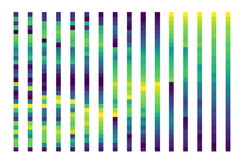
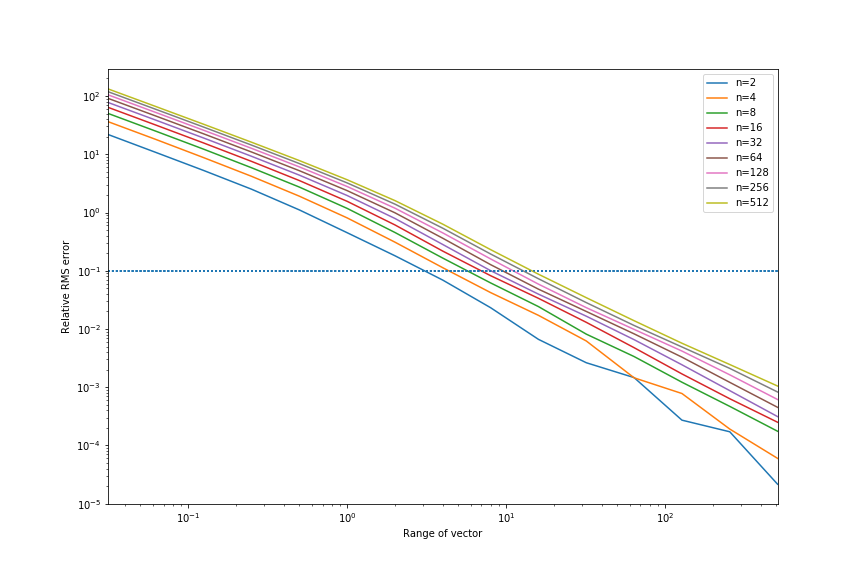
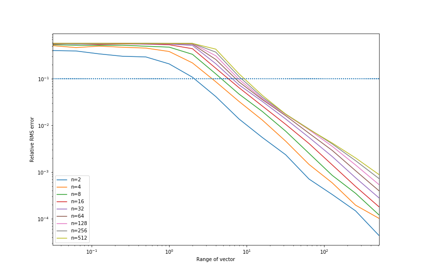

# Differentiable parallel approximate sorting networks
A Python implementation of a fully-differentiable *approximate* sorting function for power-of-2 length vectors. Uses Numpy (or autograd, JAX or PyTorch), but trivial to use in other backends. Works on GPU. 




      
        
```python
    from differentiable_sorting import bitonic_matrices, diff_bisort, diff_argsort

    # sort 8 element vectors
    sort_matrices = bitonic_matrices(8)
    x = [5.0, -1.0, 9.5, 13.2, 16.2, 20.5, 42.0, 18.0]

    print(diff_sort(sort_matrices, x)) 
    >>> [-1.007  4.996  9.439 13.212 15.948 18.21  20.602 42.   ]

    # we can relax towards averaging by plugging in another
    # softmax function to the network    
    from differentiable_sorting import softmax_smooth
    
    print(diff_sort(sort_matrices, x, lambda a,b: softmax_smooth(a,b, 0.0))) # as above
    >>> [-1.007  4.996  9.439 13.212 15.948 18.21  20.602 42.   ]

    print(diff_sort(sort_matrices, x, lambda a,b: softmax_smooth(a,b, 0.05))) # smoothed
    >>> [ 1.242  5.333  9.607 12.446 16.845 18.995 20.932 37.999]
        
    print(diff_sort(sort_matrices, x, lambda a,b: softmax_smooth(a,b, 1.0))) # relax completely to mean
    >>> [15.425 15.425 15.425 15.425 15.425 15.425 15.425 15.425]

    print(np.mean(x))
    >>> 15.425

    ###### Ranking
    # We can rank as well
    x = [1, 2, 3, 4, 8, 7, 6, 4]

    print(diff_argsort(sort_matrices, x))
    >>> [0. 1. 2. 3. 7. 6. 5. 3.]

    # smoothed ranking function
    print(diff_argsort(sort_matrices, x, sigma=0.25))
    >>> [0.13 1.09 2.   3.11 6.99 6.   5.   3.11]

    # using autograd to differentiate smooth argsort
    from autograd import jacobian
    jac_rank = jacobian(diff_argsort, argnum=1)
    print(jac_rank(matrices, np.array(x), 0.25))

    >>>     [[ 2.162 -1.059 -0.523 -0.287 -0.01  -0.018 -0.056 -0.21 ]
            [-0.066  0.562 -0.186 -0.155 -0.005 -0.011 -0.035 -0.105]
            [-0.012 -0.013  0.041 -0.005 -0.    -0.001 -0.002 -0.008]
            [-0.012 -0.025 -0.108  0.564 -0.05  -0.086 -0.141 -0.14 ]
            [-0.001 -0.001 -0.003 -0.005  0.104 -0.058 -0.028 -0.008]
            [-0.    -0.001 -0.002 -0.004 -0.001  0.028 -0.012 -0.007]
            [-0.    -0.    -0.001 -0.002 -0.016 -0.018  0.038 -0.001]
            [-0.012 -0.025 -0.108 -0.209 -0.05  -0.086 -0.141  0.633]]
```

Caveats:
* May not be very efficient (!), requiring approximately `2 log_2(n)^2` matrix multiplies of size `n x n`. These are just permutations, so can also be efficiently implemented via indexing, requiring `2n` indexing operations per layer.
* Numerical precision is limited, especially with `float32`. Very large or very small values will cause trouble. Values distributed between 1 and 200 work reasonably. Values less than 1.0 are troublesome. 
* The networks are *theoretically* differentiable, but gradients may be very small for larger networks.

## Libraries

The base code works with NumPy. If you want to use [autograd](https://github.com/HIPS/autograd) [jax](https://github.com/google/jax) or [cupy](https://cupy.chainer.org/) then install the [autoray](https://pypi.org/project/autoray/) package.

    pip install autoray

The code should then automatically work with whatever backend you are using. I have only tested `autograd` as a NumPy drop in. 

`differentiable_sorting_torch.py` implements the necessary components in PyTorch. Tensorflow is also supported:

```python 
import tensorflow as tf
from differentiable_sorting import bitonic_matrices, diff_sort, diff_argsort

tf_input = tf.reshape(tf.convert_to_tensor([5.0, -1.0, 9.5, 13.2, 16.2, 20.5, 42.0, 18.0], dtype=tf.float64), (-1,1))
tf_output = tf.reshape(diff_sort(tf_matrices, tf_input), (-1,))
with tf.Session() as s:    
    print(s.run((tf_output)))    

>>> [-1.007  4.996  9.439 13.212 15.948 18.21  20.602 42.   ]    
```


## Bitonic sorting

[Bitonic sorts](https://en.wikipedia.org/wiki/Bitonic_sorter) allow creation of sorting networks with a sequence of fixed conditional swapping operations executed on an `n` element vector in parallel where, `n=2^k`.


*[Image: from Wikipedia, by user Bitonic, CC0](https://en.wikipedia.org/wiki/Bitonic_sorter#/media/File:BitonicSort1.svg)*

The sorting network for `n=2^k` elements has `k(k-1)/2` "layers" where parallel compare-and-swap operations are used to rearrange a `n` element vector into sorted order.

### Differentiable compare-and-swap

If we define the `softmax(a,b)` function (not the traditional "softmax" used for classification, but rather log-sum-exp!) as the continuous approximation to the `max(a,b)` function, `softmax(a,b) = log(exp(a) + exp(b))`. We can then write `softmin(a,b)` as `softmin(a,b) = a + b - softmax(a,b)`

Note that we now have a differentiable compare-and-swap operation: `softcswap(a,b) = (softmin(a,b), softmax(a,b))`

We can also use the `smoothmax(a,b, alpha) = a * exp(a*alpha) +  b* exp(b*alpha) / (exp(a*alpha)+exp(b*alpha))`, which has a configurable `alpha` term, allowing interpolation between a hard maximum (alpha -> infinity) and mean averaging (alpha -> 0).

I assume this idea is well known, but I couldn't find an obvious implementation.
This implementation was inspired by [this tweet](https://twitter.com/francoisfleuret/status/1139580698694733825) by @francoisfleuret:
> François Fleuret @francoisfleuret Jun 14
>
>Discussion with Ronan Collober reminded me that (max, +) is a semi-ring, and made me realize that the same is true for (softmax, +) where
>
>softmax(a, b) = log(exp(a) + exp(b))
>
>All this coolness at the heart of his paper 
>
>https://arxiv.org/abs/1902.06022 

## Differentiable sorting

For each layer in the sorting network, we can split all of the pairwise comparison-and-swaps into left-hand and right-hand sides. We can any write function that selects the relevant elements of the vector as a multiply with a binary matrix.

For each layer, we can derive two binary matrices `left` and `right` which select the elements to be compared for the left and right hands respectively. This will result in the comparison between two `n/2` length vectors. We can also derive two matrices `l_inv` and `r_inv` which put the results of the compare-and-swap operation back into the right positions in the original vector.

The entire sorting network can then be written in terms of matrix multiplies and the `softcswap(a, b)` operation.

```python
        def softmax(a, b):
            return np.log(np.exp(a) + np.exp(b))

        def softmin(a, b):
            return a+b-softmax(a, b)

        def softcswap(a, b):
            return softmin(a, b), softmax(a, b)

        def diff_bisort(matrices, x):   
            for l, r, l_inv, r_inv in matrices:
                a, b = softcswap(l @ x, r @ x)
                x = l_inv @ a + r_inv @ b
            return x
```

The rest of the code is simply computing the `l, r, l_inv, r_inv` matrices, which are fixed for a given `n`. If we're willing to include a split and join operation, we can reduce this to two `n x n` multiplies:


```python
    def diff_bisort_weave(matrices, x):
        """
        Given a set of bitonic sort matrices generated by bitonic_woven_matrices(n), sort 
        a sequence x of length n.
        """
        split = len(x) // 2
        for weave, unweave in matrices:
            woven = weave @ x
            x = unweave @ np.concatenate(softcswap(woven[:split], woven[split:]))
        return x
```

where `weave = np.vstack([l, r])` and `unweave = np.hstack([l_inv, r_inv])`.

---


## Error analysis
The plot below shows the relative RMS (RMS error divided by the maximum range of the input vector) between the softmax sorted array and the ground truth sorted array, for vectors of length `n=2` through `n=512`, with test values distributed randomly uniformly in ranges from [0, 2^-5] to [0, 2^10]. The main factor affecting precision is the numerical range. Small values will be corrupted, but values > ~300 will overflow (in `float64`):



**Softmax** error curve.



**Smoothmax** error curve.

---

There is also a function to pretty-print bitonic networks:

```python
        pretty_bitonic_network(8)
```

        0  1  2  3  4  5  6  7 
        ╭──╯  │  │  │  │  │  │ 
        │  │  ╰──╮  │  │  │  │ 
        │  │  │  │  ╭──╯  │  │ 
        │  │  │  │  │  │  ╰──╮ 
        ╭─────╯  │  │  │  │  │ 
        │  ╭─────╯  │  │  │  │ 
        │  │  │  │  ╰─────╮  │ 
        │  │  │  │  │  ╰─────╮ 
        ╭──╯  │  │  │  │  │  │ 
        │  │  ╭──╯  │  │  │  │ 
        │  │  │  │  ╰──╮  │  │ 
        │  │  │  │  │  │  ╰──╮ 
        ╭───────────╯  │  │  │ 
        │  ╭───────────╯  │  │ 
        │  │  ╭───────────╯  │ 
        │  │  │  ╭───────────╯ 
        ╭─────╯  │  │  │  │  │ 
        │  ╭─────╯  │  │  │  │ 
        │  │  │  │  ╭─────╯  │ 
        │  │  │  │  │  ╭─────╯ 
        ╭──╯  │  │  │  │  │  │ 
        │  │  ╭──╯  │  │  │  │ 
        │  │  │  │  ╭──╯  │  │ 
        │  │  │  │  │  │  ╭──╯ 